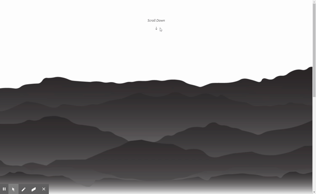

# Inktober Challenge

[![Contributors][contributors-shield]][contributors-url]
[![Forks][forks-shield]][forks-url]
[![Stargazers][stars-shield]][stars-url]
[![Issues][issues-shield]][issues-url]
[![MIT License][license-shield]][license-url]
[![LinkedIn][linkedin-shield]][linkedin-url]

Explore the [project page](https://github.com/dansirdan/inktober-challenge)

View the [deployed page](https://dansirdan.github.io/inktober-challenge)

## Table of Contents

- [About the Project](#about-the-project)
  - [Built With](#built-with)
- [Roadmap](#roadmap)
- [License](#license)
- [Contact](#contact)
- [Acknowledgements](#acknowledgements)

## About The Project

This project was a really fun, 3-Day sprint in which I wanted to learn how to code my own Parallax effect using plain HTML and CSS. I followed a few guides and researched for the majority of the first day. Along with researching transform, position absolute, and various other CSS properties I also created my images from scratch using Adobe Illustrator.

The following assets were instrumental in understanding how to achieve my design idea:

- [Hamish Macpherson](https://codepen.io/samdbeckham/pen/OPXPNp)
- [Campo Santo](http://www.firewatchgame.com/)
- [Adobe Illustrator](https://www.adobe.com/products/illustrator.html)

### Built With

- semantic HTML
- CSS
- Bootstrap

## Roadmap

Currently no known issues, but track [open issues](https://github.com/dansirdan/inktober-challenge/issues) will be adding JavaScript to create a dynamic carousel that looks at a json file and loads all of my images.

## Contact

- Twitter - [@DanielMont_Eton](https://twitter.com/DanielMont_Eton)
- LinkedIn - [LinkedIn](https://www.linkedin.com/in/daniel-mont-eton-43a81055/)

[contributors-shield]: https://img.shields.io/github/contributors/dansirdan/inktober-challenge.svg?style=flat-square
[contributors-url]: https://github.com/dansirdan/inktober-challenge/graphs/contributors
[forks-shield]: https://img.shields.io/github/forks/dansirdan/inktober-challenge.svg?style=flat-square
[forks-url]: https://github.com/dansirdan/inktober-challenge/network/members
[stars-shield]: https://img.shields.io/github/stars/dansirdan/inktober-challenge.svg?style=flat-square
[stars-url]: https://github.com/dansirdan/inktober-challenge/stargazers
[issues-shield]: https://img.shields.io/github/issues/dansirdan/inktober-challenge.svg?style=flat-square
[issues-url]: https://github.com/dansirdan/inktober-challenge/issues
[license-shield]: https://img.shields.io/github/license/dansirdan/inktober-challenge.svg?style=flat-square
[license-url]: https://github.com/dansirdan/inktober-challenge/blob/master/LICENSE
[linkedin-shield]: https://img.shields.io/badge/-LinkedIn-black.svg?style=flat-square&logo=linkedin&colorB=555
[linkedin-url]: https://linkedin.com/in/daniel-mont-eton-43a81055/
